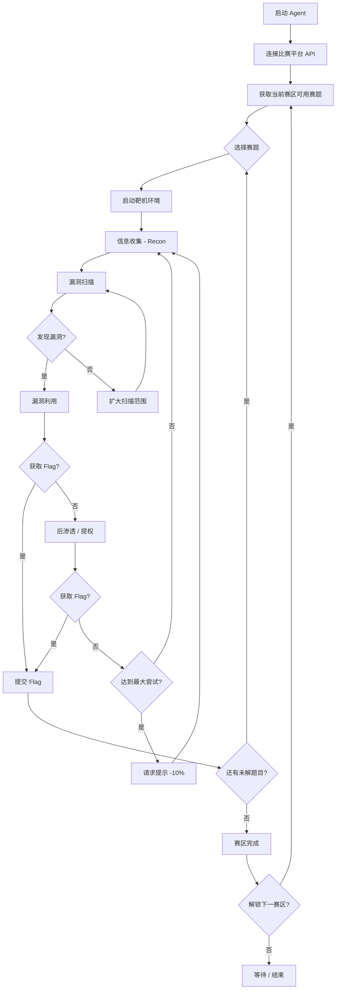

# 自主渗透智能体 (Auto-Hacker Agent) 实现方案

## 背景

本项目是为参加智能渗透主战场比赛而构建的自主渗透智能体。智能体以大语言模型（LLM）为核心决策引擎，在隔离的 CVM（Ubuntu 24, 8C16G）环境中自主运行，完成从漏洞发现、利用执行到 Flag 提交的全流程。

### 比赛核心要点
- **4个赛区**：闯关模式，需达到分数阈值解锁下一赛区
- **弹性赛段**：每天3次挑战机会，零点刷新
- **黑盒环境**：无附件，纯黑盒渗透
- **API 交互**：通过官方 API 获取赛题、启停靶机、提交 Flag、查询提示
- **Flag 格式**：`flag{}`
- **网络限制**：挑战时段仅允许访问大模型服务和赛题靶机
- **非手工原则**：全程 Agent 驱动，禁止人工干预

---

## User Review Required

> [!IMPORTANT]
> **大模型选择**：你计划使用什么大模型？DeepSeek / GPT-4o / Claude / 其他？这会影响 API 配置和提示词设计。

> [!IMPORTANT]
> **API Key 管理**：你已经有大模型 API Key 了吗？还是等赛前发放的体验 Key？

> [!WARNING]
> **官方 API 尚未发布**：赛前才会提供平台交互 API 和 Skills，当前我们会设计好 API 抽象层，等官方文档发布后快速接入。

---

## 项目架构

```
d:\program\auto-hacker\
├── README.md                    # 项目说明
├── requirements.txt             # Python 依赖
├── config.yaml                  # 配置文件（模型、API 等）
├── .env.example                 # 环境变量模板
├── main.py                      # 程序入口
├── agent/                       # 核心智能体模块
│   ├── __init__.py
│   ├── core.py                  # Agent 主循环 (ReAct Loop)
│   ├── llm.py                   # LLM 抽象层（支持多模型切换）
│   ├── memory.py                # 上下文记忆管理
│   ├── planner.py               # 任务规划器
│   └── prompts.py               # 系统提示词模板
├── platform/                    # 比赛平台交互
│   ├── __init__.py
│   ├── api_client.py            # 官方 API 客户端（预留接口）
│   └── models.py                # 数据模型（赛题、Flag 等）
├── tools/                       # 渗透工具封装
│   ├── __init__.py
│   ├── base.py                  # 工具基类
│   ├── shell.py                 # Shell 命令执行
│   ├── nmap_tool.py             # Nmap 端口扫描
│   ├── web_tools.py             # Web 渗透（curl, dirb, nikto等）
│   ├── sqli_tool.py             # SQL 注入（sqlmap 封装）
│   ├── exploit_tool.py          # 漏洞利用（Metasploit/手工 exploit）
│   └── file_tools.py            # 文件操作工具
├── strategy/                    # 渗透策略
│   ├── __init__.py
│   ├── recon.py                 # 信息收集策略
│   ├── vuln_scan.py             # 漏洞扫描策略
│   ├── exploit.py               # 漏洞利用策略
│   └── post_exploit.py          # 后渗透策略
├── utils/                       # 工具函数
│   ├── __init__.py
│   ├── logger.py                # 日志系统
│   ├── flag_parser.py           # Flag 提取 & 验证
│   └── network.py               # 网络工具函数
└── tests/                       # 测试
    ├── __init__.py
    ├── test_tools.py
    └── test_agent.py
```

---

## Proposed Changes

### 1. 核心 Agent 模块 (`agent/`)

#### [NEW] [core.py](file:///d:/program/auto-hacker/agent/core.py)
Agent 主循环，采用 **ReAct (Reasoning + Acting)** 模式：
1. **感知** → 接收任务信息和工具输出
2. **推理** → LLM 分析当前状态，决定下一步行动
3. **行动** → 调用工具执行操作
4. **观察** → 收集结果，更新记忆
5. **检查** → 从结果中提取 Flag，若成功则提交

关键设计：
- 最大迭代次数限制（防止无限循环）
- 错误重试机制
- 超时控制
- 自动 Flag 检测和提交

#### [NEW] [llm.py](file:///d:/program/auto-hacker/agent/llm.py)
LLM 抽象层，通过 `litellm` 支持多模型统一调用：
- DeepSeek API
- OpenAI 兼容接口
- 字节跳动模型
- 可配置的模型参数（temperature、max_tokens 等）

#### [NEW] [memory.py](file:///d:/program/auto-hacker/agent/memory.py)
上下文记忆管理：
- 短期记忆：当前任务的对话历史
- 长期记忆：已发现的信息（IP、端口、凭据、漏洞）
- 记忆压缩：防止 token 超限

#### [NEW] [planner.py](file:///d:/program/auto-hacker/agent/planner.py)
高层任务规划器：
- 根据赛区类型选择渗透策略
- 动态调整攻击优先级
- 管理多题目并行调度

#### [NEW] [prompts.py](file:///d:/program/auto-hacker/agent/prompts.py)
系统提示词模板：
- 渗透测试专家角色设定
- 工具使用说明
- 输出格式约束（JSON action）
- 各赛区特定策略提示

---

### 2. 平台交互模块 (`platform/`)

#### [NEW] [api_client.py](file:///d:/program/auto-hacker/platform/api_client.py)
官方 API 客户端（预留接口，等官方文档后对接）：
- `get_challenges()` — 获取当前可用赛题
- `start_challenge(challenge_id)` — 启动靶机
- `stop_challenge(challenge_id)` — 停止靶机
- `submit_flag(challenge_id, flag)` — 提交 Flag
- `get_hint(challenge_id)` — 获取提示（注意 -10% 扣分）
- `get_score()` — 查询当前分数

#### [NEW] [models.py](file:///d:/program/auto-hacker/platform/models.py)
Pydantic 数据模型：
- `Challenge` — 赛题信息
- `FlagSubmission` — Flag 提交
- `ChallengeResult` — 解题结果

---

### 3. 工具模块 (`tools/`)

#### [NEW] [base.py](file:///d:/program/auto-hacker/tools/base.py)
工具基类，定义统一接口：
- `name` / `description` — 供 LLM 了解工具能力
- `execute(params)` — 执行工具
- `parse_output(raw)` — 解析输出

#### [NEW] [shell.py](file:///d:/program/auto-hacker/tools/shell.py)
通用 Shell 命令执行器：
- 支持同步/异步执行
- 超时控制
- 危险命令过滤
- 输出截断（防止 token 超限）

#### [NEW] [nmap_tool.py](file:///d:/program/auto-hacker/tools/nmap_tool.py)
Nmap 封装：快速扫描、服务识别、脚本扫描

#### [NEW] [web_tools.py](file:///d:/program/auto-hacker/tools/web_tools.py)
Web 渗透工具集：
- HTTP 请求（curl 封装）
- 目录扫描（dirb/gobuster）
- 漏洞扫描（nikto）

#### [NEW] [sqli_tool.py](file:///d:/program/auto-hacker/tools/sqli_tool.py)
SQLMap 封装：自动 SQL 注入检测和利用

#### [NEW] [exploit_tool.py](file:///d:/program/auto-hacker/tools/exploit_tool.py)
漏洞利用工具：
- Metasploit RPC 调用（如可用）
- 自定义 exploit 脚本执行
- 反弹 Shell 管理

#### [NEW] [file_tools.py](file:///d:/program/auto-hacker/tools/file_tools.py)
文件操作：读取/写入/搜索文件内容

---

### 4. 渗透策略模块 (`strategy/`)

#### [NEW] [recon.py](file:///d:/program/auto-hacker/strategy/recon.py)
信息收集策略：端口扫描 → 服务识别 → Web 指纹

#### [NEW] [vuln_scan.py](file:///d:/program/auto-hacker/strategy/vuln_scan.py)
漏洞扫描策略：根据服务类型选择扫描方式

#### [NEW] [exploit.py](file:///d:/program/auto-hacker/strategy/exploit.py)
漏洞利用策略：匹配已知 CVE → 尝试利用 → 验证

#### [NEW] [post_exploit.py](file:///d:/program/auto-hacker/strategy/post_exploit.py)
后渗透策略：权限提升、横向移动、Flag 搜索

---

### 5. 工具函数 (`utils/`)

#### [NEW] [logger.py](file:///d:/program/auto-hacker/utils/logger.py)
结构化日志：记录每一步推理和操作，用于赛后复盘

#### [NEW] [flag_parser.py](file:///d:/program/auto-hacker/utils/flag_parser.py)
Flag 提取：正则匹配 `flag{...}`，自动从工具输出中捕获

#### [NEW] [network.py](file:///d:/program/auto-hacker/utils/network.py)
网络工具：端口检测、服务探测等辅助函数

---

### 6. 配置和入口

#### [NEW] [main.py](file:///d:/program/auto-hacker/main.py)
程序入口：
- 加载配置
- 初始化 Agent
- 连接比赛平台 API
- 进入自主渗透循环

#### [NEW] [config.yaml](file:///d:/program/auto-hacker/config.yaml)
配置文件：
- LLM 模型选择和参数
- API 端点
- 工具路径
- 超时设置
- 日志级别

#### [NEW] [requirements.txt](file:///d:/program/auto-hacker/requirements.txt)
Python 依赖列表

#### [NEW] [README.md](file:///d:/program/auto-hacker/README.md)
项目说明文档

---

## Agent 工作流程



---

## Open Questions

> [!IMPORTANT]
> 1. **大模型选择**：你打算使用什么大模型？这影响 API 配置和 token 消耗优化策略。
> 2. **是否已有 API Key**？需要我在代码中预设某个模型的配置吗？

> [!NOTE]
> 3. **官方 API 接口**格式尚未公布（预计清明后），当前采用预留接口设计，后续可快速适配。
> 4. **CVM 环境工具**：Ubuntu 24 默认不带 nmap/sqlmap 等安全工具，是否需要包含工具安装脚本？

---

## Verification Plan

### 自动化测试
- 单元测试：各工具模块的输入输出验证
- 集成测试：模拟 Agent 循环（mock LLM 响应）
- Flag 正则提取测试

### 手动验证
- 在本地 Docker 环境中部署简单靶机进行端到端测试
- 验证日志记录完整性
- 验证 LLM 调用正常
